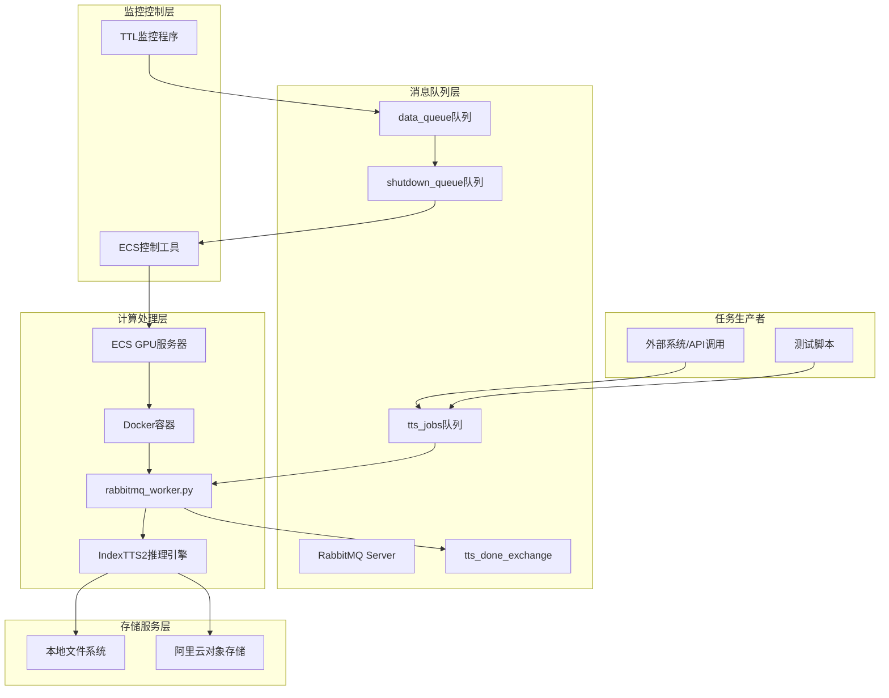
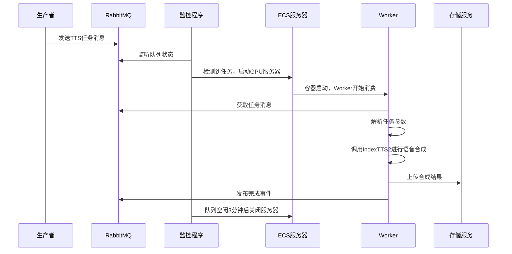

# IndexTTS2 分布式语音合成系统

## 项目概述

IndexTTS2 是一个基于 RabbitMQ 消息队列的分布式文本转语音（TTS）任务处理系统。该系统通过消息队列实现任务调度，使用阿里云 ECS GPU 服务器进行语音合成计算，实现按需使用 GPU 资源，有效节省成本。

### 核心特性
- ✅ **分布式架构**：基于消息队列的异步任务处理
- ✅ **智能资源管理**：自动开关机，按需使用 GPU 资源
- ✅ **灵活数据源**：支持本地文件和 API 两种文本获取模式
- ✅ **云存储集成**：自动上传结果到云存储，支持七牛云
- ✅ **事件驱动**：完成事件通知机制，支持下游系统集成
- ✅ **高性能模型**：基于 IndexTTS2，支持情感控制和时长可控的语音合成

### 主要优势（快速了解）
1. 一键安装与部署（零门槛）  
   - 项目提供一键安装与启动脚本（支持 uv/虚拟环境与 Docker 镜像），尽量降低对运维与环境配置的要求。开发者或运维仅需执行少量命令即可完成依赖安装、模型下载与服务启动，无需深入的系统或云平台操作经验。
2. 本地调试 -> OSS / 内网模式（快速加载模型）  
   - 开发者可先在本地完成模型调试与验证，然后将模型文件一键上传到对象存储（OSS），并与新的 ECS 实例组成内网模式部署。使用内网挂载或镜像化模型数据可以显著缩短模型加载时间（避免每次冷启动长时间等待），提升系统响应与冷启动速度。
3. 智能弹性资源（按需开关机，节约成本）  
   - 使用 RabbitMQ 触发式调度：有任务即自动启动 ECS GPU 实例并运行 Worker，无任务时自动关机回收资源。该机制能有效节约云成本、减少空闲资源占用并降低持续运行带来的管理开销。
4. Docker 部署对 AI 的优势（可复现、隔离、便于扩展）  
   - 依赖隔离：容器封装全部运行环境（系统库、Python 包、工具链），避免“在我机器能跑”的环境差异问题。  
   - GPU 支持与调度：通过 Docker 与 NVIDIA Container Toolkit 可安全传递 GPU，简化 GPU 驱动与 CUDA 兼容性管理。  
   - 可复现与可移植：同一镜像可在本地、测试与生产环境一致运行，便于验证与回滚。  
   - 弹性扩容：结合容器编排（Docker Compose / Swarm / Kubernetes）可以水平扩展 Worker，支持高并发场景。  

### 应用场景
- 大规模文本转语音批量处理
- 实时语音合成服务
- 视频配音和多媒体内容生产
- AI 语音交互系统
- 企业级语音处理平台

---

## 技术栈清单

### 核心组件技术栈

| 组件 | 技术栈 | 版本要求 | 说明 |
|------|--------|----------|------|
| **语音合成引擎** | Python + PyTorch | Python 3.11+ | IndexTTS2 模型推理 |
| **消息队列** | RabbitMQ | 3.8+ | 任务调度和分布式处理 |
| **云服务器管理** | Go + Alibaba Cloud SDK | Go 1.21+ | ECS 实例自动开关机 |
| **容器化部署** | Docker | 24.0+ | 应用容器化和分发 |
| **配置管理** | YAML + 环境变量 | - | 系统配置和参数管理 |

### Python 核心依赖

**基础框架**：
- `torch==2.3.1` - PyTorch 深度学习框架
- `torchaudio==2.3.1` - PyTorch 音频处理库
- `numpy==2.3.5` - 数值计算库
- `scipy==1.16.3` - 科学计算库

**音频处理**：
- `librosa==0.11.0` - 音频分析库
- `soundfile==0.13.1` - 音频文件读写
- `pyloudnorm==0.1.1` - 音频响度标准化
- `pystoi==0.4.1` - 语音质量评估

**消息队列**：
- `pika==1.3.2` - RabbitMQ Python 客户端

**工具库**：
- `omegaconf==2.3.0` - 配置管理
- `tqdm==4.67.1` - 进度条显示
- `requests==2.32.5` - HTTP 请求库
- `huggingface-hub==0.36.0` - HuggingFace 模型管理

### Go 组件依赖

**云服务集成**：
- `aliyun/alibaba-cloud-sdk-go` - 阿里云 SDK
- `streadway/amqp` - RabbitMQ Go 客户端

**工具库**：
- `spf13/viper` - 配置管理
- `sirupsen/logrus` - 日志记录
- `google/uuid` - UUID 生成

### 系统依赖

**运行环境**：
- Ubuntu 20.04+ / CentOS 7+
- NVIDIA GPU (推荐 RTX 30系列及以上)
- CUDA 12.8+ (自动随 PyTorch 安装)
- Docker 24.0+

**存储服务**：
- MySQL 8.0+ (可选，用于元数据存储)
- 七牛云对象存储 (可选，用于结果存储)
- 本地文件系统 (默认存储)

---

## 系统架构概览



### 核心工作流程



### 架构设计原则

1. **按需资源利用**：通过消息队列触发 ECS 自动开关机，避免资源浪费
2. **异步任务处理**：解耦任务提交和执行，提高系统响应性
3. **容错性设计**：消息确认机制和错误重试，确保任务可靠性
4. **可扩展性**：支持水平扩展 Worker 实例和队列分区
5. **监控运维**：TTL 机制实现自动资源回收，降低运维成本

---

## 关键模块说明

### 1. 阿里云ECS控制模块 (aliyun/)

**功能职责**：
- 自动管理阿里云 ECS GPU 实例的开关机
- 通过 RabbitMQ 消息队列监听任务状态
- 实现 TTL（Time To Live）机制的自动资源回收

**核心文件**：
- `ttl_rabbitmq.go` - 主监控程序，常驻运行监听队列
- `run_ecs.go` - ECS 实例控制工具，支持启动/停止/查询
- `config.yml` - 阿里云配置（AccessKey、实例ID、地域等）

**关键配置参数**：
```yaml
# 阿里云认证信息
access_key_id: "******************"
access_key_secret: "*******************"
region_id: "cn-shenzhen"
instance_id: "i-wz931cjckszqmjerwcyg"

# 购买配置（可选）
purchase_config:
  instance_types:
    - "ecs.gn6v-c8g1.2xlarge #低端测试用的服务器"
    - "ecs.gn6v-c8g1.4xlarge #用于人物交互"
  security_group_id: "sg-wz9j9o62jt1b5aszv6a0"
  vswitch_id: "vsw-wz94gm04er9vhpywgmodw"
  spot_strategy: "SpotAsPriceGo"

# OSS挂载配置
oss_config:
  bucket: "indextts2bucket"
  endpoint: "oss-cn-shenzhen.aliyuncs.com"
  mount_point: "/mnt/oss"
```

### 2. Python语音合成模块 (python_indextts_code/)

**功能职责**：
- 实现 IndexTTS2 语音合成模型的推理服务
- 通过 RabbitMQ 消费任务并执行语音合成
- 支持多种输入格式和参数配置

**核心文件**：
- `indextts/app/rabbitmq_worker.py` - RabbitMQ 任务消费者
- `indextts/infer_v2.py` - IndexTTS2 核心推理引擎
- `indextts/app/rabbitmq_config.yaml` - Worker 配置文件
- `checkpoints/` - 模型权重文件目录

**Worker 配置参数**：
```yaml
# RabbitMQ 连接配置
rabbitmq:
  host: "localhost"
  port: 5672
  user: "guest"
  password: "guest"
  vhost: "/"

# 文本获取配置
text:
  local_root: "/data/texts"  # 本地文本文件根目录
  api:
    base_url: "http://api.example.com"  # API 文本获取地址

# TTS 模型配置
tts:
  model_dir: "/app/checkpoints"  # 模型文件目录
  config_path: "config.yaml"  # 模型配置文件
  device: "cuda"  # 推理设备
  use_fp16: true  # 是否使用半精度推理

# 七牛云上传配置
qiniu:
  enable: true  # 是否启用七牛云上传
  access_key: "your_access_key"
  secret_key: "your_secret_key"
  bucket: "your_bucket"
  domain: "https://your_domain.com"
```

### 3. Docker容器化模块 (docker/)

**功能职责**：
- 提供完整的应用容器化环境
- 优化镜像大小和启动速度
- 支持 GPU 加速和依赖管理

**核心文件**：
- `Dockerfile` - 应用容器镜像定义
- `docker-entrypoint.sh` - 容器启动脚本
- `docker-data/requirements.txt` - Python 依赖清单

**镜像特性**：
- 基于 Python 3.11 slim 镜像，体积优化
- 预装音频处理系统依赖（libsndfile、ffmpeg）
- 支持 GPU 加速（CUDA 12.8+）
- 自动处理 xformers 兼容性问题
- 最小化依赖安装，减少镜像大小

### 4. 数据库初始化模块 (scripts/)

**功能职责**：
- 提供系统所需的数据库表结构
- 支持用户管理、文件管理和音频元数据存储

**核心文件**：
- `init_database.sql` - MySQL 数据库初始化脚本

**数据库表结构**：
- `users` - 用户信息表（ID、用户名、邮箱、密码、状态等）
- `files` - 文件信息表（用户ID、文件名、存储路径、文件类型、大小等）
- `audio_files` - 音频文件扩展信息表（时长、采样率、格式等）

---

## 部署与运行说明

### 环境准备

**系统要求**：
- Ubuntu 20.04+ 或 CentOS 7+
- NVIDIA GPU (推荐 8GB+ VRAM)
- Docker 24.0+
- Git 2.30+

**网络要求**：
- 阿里云 ECS 实例访问权限
- RabbitMQ 服务访问权限
- 七牛云对象存储访问权限（可选）

### 快速部署流程

#### 1. 代码获取和环境配置

```bash
# 克隆项目
git clone https://github.com/your-repo/index-tts-distributed.git
cd index-tts-distributed

# 安装 Python 环境（推荐使用 uv 包管理器）
pip install uv
uv sync --all-extras

# 激活虚拟环境
source .venv/bin/activate
```

#### 2. RabbitMQ 服务配置

```bash
# 使用 Docker 启动 RabbitMQ
docker run -d --name rabbitmq \
  -p 5672:5672 -p 15672:15672 \
  -e RABBITMQ_DEFAULT_USER=admin \
  -e RABBITMQ_DEFAULT_PASS=password \
  rabbitmq:3-management

# 创建所需队列和交换机
# 可以通过管理界面 (http://localhost:15672) 创建，或使用脚本
```

#### 3. 阿里云 ECS 配置

```bash
# 配置阿里云认证信息
cp aliyun/config.example.yml aliyun/config.yml
# 编辑 config.yml 填入真实的 AccessKey 和实例ID

# 编译 ECS 控制工具
cd aliyun
go mod tidy
go build -o run_ecs run_ecs.go

# 启动监控程序（常驻运行）
nohup ./ttl_rabbitmq > logs/ttl_rabbitmq.log 2>&1 &
```

#### 4. 模型和数据准备

```bash
# 下载 IndexTTS2 模型（约 2GB）
cd python_indextts_code
uv run huggingface-cli download IndexTeam/IndexTTS-2 --local-dir checkpoints

# 准备测试数据
mkdir -p uploads/sample_library
# 复制测试音频文件到 uploads/sample_library/
```

#### 5. Docker 镜像构建

```bash
# 构建应用镜像
cd docker
docker build -t indextts-worker:latest .

# 或者使用预构建镜像
docker pull your-registry/indextts-worker:latest
```

#### 6. 系统启动

```bash
# 方式1：直接运行 Python Worker
cd python_indextts_code
uv run python indextts/app/rabbitmq_worker.py

# 方式2：使用 Docker 容器运行
docker run --gpus all \
  -v /path/to/checkpoints:/app/checkpoints \
  -v /path/to/uploads:/app/uploads \
  -e RABBITMQ_HOST=your-rabbitmq-host \
  indextts-worker:latest
```

### 生产环境部署

#### 使用 Docker Compose

```yaml
version: '3.8'
services:
  rabbitmq:
    image: rabbitmq:3-management
    ports:
      - "5672:5672"
      - "15672:15672"
    environment:
      RABBITMQ_DEFAULT_USER: admin
      RABBITMQ_DEFAULT_PASS: password

  indextts-worker:
    image: indextts-worker:latest
    deploy:
      resources:
        reservations:
          devices:
            - driver: nvidia
              count: 1
              capabilities: [gpu]
    volumes:
      - ./checkpoints:/app/checkpoints:ro
      - ./uploads:/app/uploads
      - ./rabbitmq_outputs:/app/rabbitmq_outputs
    environment:
      - RABBITMQ_HOST=rabbitmq
      - CUDA_VISIBLE_DEVICES=0
    depends_on:
      - rabbitmq
```

#### 阿里云 ECS 实例规格推荐

| 场景 | 实例规格 | GPU 内存 | 适用任务量 | 预估成本 |
|------|----------|----------|------------|----------|
| 轻量测试 | ecs.gn6v-c8g1.2xlarge | 16GB | 1-5 个并发任务 | ¥0.5-1/小时 |
| 标准生产 | ecs.gn6v-c8g1.4xlarge | 32GB | 5-20 个并发任务 | ¥1-2/小时 |
| 高性能生产 | ecs.gn6v-c8g1.8xlarge | 64GB | 20+ 个并发任务 | ¥2-4/小时 |

### 配置参数说明

#### 核心性能参数

| 参数 | 默认值 | 推荐值 | 说明 |
|------|--------|--------|------|
| `use_fp16` | `false` | `true` | 启用半精度推理，减少显存占用 |
| `use_cuda_kernel` | `false` | `true` | 使用 CUDA 内核加速推理 |
| `batch_size` | `1` | `1-4` | 批处理大小，影响并发性能 |
| `max_workers` | `1` | `2-4` | 最大 Worker 进程数 |

#### 资源管理参数

| 参数 | 默认值 | 说明 |
|------|--------|------|
| `ttl_seconds` | `180` | 队列空闲时间（秒），超过后关闭 ECS |
| `max_instances` | `1` | 最大并发 ECS 实例数 |
| `gpu_memory_threshold` | `0.8` | GPU 内存使用阈值，超过后拒绝新任务 |

#### 存储配置参数

```yaml
# 本地存储配置
storage:
  local:
    root_dir: "/app/data"
    temp_dir: "/tmp/indextts"
    max_file_age: "24h"  # 临时文件最大年龄

# 七牛云存储配置
qiniu:
  enable: true
  access_key: "your_access_key"
  secret_key: "your_secret_key"
  bucket: "indextts-bucket"
  domain: "https://cdn.example.com"
  upload_timeout: 300  # 上传超时时间（秒）
```

---

## 模型与资源管理

### IndexTTS2 模型规格

**模型文件组成**：
- `gpt.pth` - GPT 语言模型权重（~1.2GB）
- `s2mel.pth` - 声学模型权重（~500MB）
- `config.yaml` - 模型配置文件
- `tokenizer/` - 分词器相关文件

**硬件要求**：
- **最低配置**：NVIDIA GTX 1060 6GB
- **推荐配置**：NVIDIA RTX 3060 12GB+
- **生产配置**：NVIDIA RTX 3080 24GB+

**性能基准**：
- 推理速度：~0.5-1.0 秒/句（取决于文本长度）
- GPU 内存占用：~4-8GB（半精度推理）
- 支持并发：1-4 个任务（取决于 GPU 内存）

### 资源优化策略

#### GPU 内存优化

```python
# 配置文件中的 GPU 优化设置
tts:
  use_fp16: true              # 启用半精度推理
  use_cuda_kernel: true       # 使用 CUDA 内核
  enable_flash_attention: true # 启用 Flash Attention
  gradient_checkpointing: false # 推理时关闭梯度检查点
```

#### CPU 内存优化

```python
# 内存管理配置
memory:
  max_batch_size: 4           # 最大批处理大小
  enable_memory_efficient_attention: true  # 内存高效注意力
  cpu_offload: false          # CPU 卸载（仅训练时使用）
```

#### 并发控制

```python
# 并发控制配置
concurrency:
  max_workers: 2              # 最大 Worker 进程数
  queue_size: 100             # 任务队列大小
  timeout: 3600               # 任务超时时间（秒）
```

---

## 日志、监控与故障排查

### 日志系统

**日志文件位置**：
- `aliyun/logs/` - ECS 控制程序日志
- `python_indextts_code/logs/` - TTS Worker 日志
- `rabbitmq_outputs/` - 任务输出和错误日志

**日志级别配置**：
```yaml
logging:
  level: "INFO"                # DEBUG, INFO, WARNING, ERROR
  format: "json"               # json 或 text
  max_size: "100MB"            # 单个日志文件最大大小
  max_age: "30d"               # 日志保留时间
  compress: true               # 是否压缩旧日志
```

### 监控指标

**系统监控**：
- RabbitMQ 队列长度和消息处理速率
- ECS 实例运行状态和资源使用率
- GPU 内存和利用率监控
- 任务处理成功率和平均处理时间

**业务监控**：
- 每日任务处理量统计
- 音频合成质量评估
- 存储使用情况监控
- 用户请求响应时间

### 常见问题与解决方案

#### 1. RabbitMQ 连接失败

**现象**：Worker 启动时提示连接错误
**原因**：RabbitMQ 服务未启动或网络配置错误
**解决方案**：
```bash
# 检查 RabbitMQ 服务状态
docker ps | grep rabbitmq

# 检查网络连接
telnet localhost 5672

# 查看连接配置
cat python_indextts_code/indextts/app/rabbitmq_config.yaml
```

#### 2. GPU 内存不足

**现象**：推理过程中出现 CUDA 内存错误
**原因**：GPU 内存不足或并发任务过多
**解决方案**：
```yaml
# 调整配置降低内存占用
tts:
  use_fp16: true
  batch_size: 1
  max_workers: 1

# 监控 GPU 内存使用
nvidia-smi --query-gpu=memory.used,memory.total --format=csv
```

#### 3. ECS 实例启动失败

**现象**：监控程序无法启动 ECS 实例
**原因**：阿里云权限不足或配额不足
**解决方案**：
```bash
# 检查阿里云配置
cat aliyun/config.yml

# 验证权限
./aliyun/run_ecs -action query

# 检查实例状态
./aliyun/run_ecs -action status -instance-id your-instance-id
```

#### 4. 模型文件加载失败

**现象**：Worker 启动时提示模型文件不存在
**原因**：模型文件路径配置错误或文件损坏
**解决方案**：
```bash
# 检查模型文件
ls -la python_indextts_code/checkpoints/

# 验证配置文件
cat python_indextts_code/checkpoints/config.yaml

# 重新下载模型
uv run huggingface-cli download IndexTeam/IndexTTS-2 --local-dir checkpoints
```

#### 5. 七牛云上传失败

**现象**：任务完成但上传到云存储失败
**原因**：七牛云配置错误或网络问题
**解决方案**：
```yaml
# 检查七牛云配置
cat python_indextts_code/indextts/app/rabbitmq_config.yaml | grep qiniu

# 测试上传权限
python -c "
import qiniu
# 测试代码
"
```

---

## 开发与调试提示

### 本地开发环境搭建

```bash
# 1. 安装依赖
uv sync --all-extras

# 2. 下载模型（可选，使用小模型进行测试）
uv run huggingface-cli download IndexTeam/IndexTTS-1.5 --local-dir checkpoints

# 3. 启动本地 RabbitMQ
docker run -d --name rabbitmq -p 5672:5672 -p 15672:15672 rabbitmq:3

# 4. 修改配置为本地模式
cp indextts/app/rabbitmq_config.yaml indextts/app/rabbitmq_config.local.yaml
# 编辑本地配置...

# 5. 运行 Worker
uv run python indextts/app/rabbitmq_worker.py --config rabbitmq_config.local.yaml
```

### 测试脚本使用

```bash
# 发送测试任务
uv run python tests/rabbitmq_publish_sample.py

# 检查队列状态
uv run python tools/check_queue_status.py

# 验证 TTS 功能
uv run python tests/test_tts_generate.py --mode local
```

### 调试技巧

**启用详细日志**：
```yaml
logging:
  level: "DEBUG"
  format: "text"
```

**单步调试**：
```python
# 在 rabbitmq_worker.py 中添加调试断点
import pdb; pdb.set_trace()
```

**性能分析**：
```python
# 使用 PyTorch Profiler
from torch.profiler import profile, record_function, ProfilerActivity

with profile(activities=[ProfilerActivity.CPU, ProfilerActivity.CUDA]) as prof:
    # 推理代码
prof.export_chrome_trace("trace.json")
```

---

## 附录

### 重要文件路径索引

| 路径 | 说明 |
|------|------|
| `aliyun/config.yml` | ECS 控制配置 |
| `python_indextts_code/indextts/app/rabbitmq_config.yaml` | Worker 配置 |
| `python_indextts_code/checkpoints/` | 模型文件目录 |
| `docker/Dockerfile` | 容器镜像定义 |
| `scripts/init_database.sql` | 数据库初始化脚本 |
| `docs/` | 详细文档目录 |

### 环境变量说明

| 变量名 | 默认值 | 说明 |
|--------|--------|------|
| `RABBITMQ_HOST` | `localhost` | RabbitMQ 服务地址 |
| `RABBITMQ_PORT` | `5672` | RabbitMQ 服务端口 |
| `CUDA_VISIBLE_DEVICES` | `0` | 可见的 GPU 设备 |
| `PYTHONPATH` | - | Python 模块搜索路径 |
| `HF_ENDPOINT` | - | HuggingFace 镜像地址 |

### 版本兼容性

| 组件 | 支持版本 |
|------|----------|
| Python | 3.11+ |
| PyTorch | 2.3.1+ |
| CUDA | 12.8+ |
| Docker | 24.0+ |
| RabbitMQ | 3.8+ |
| Go | 1.21+ |

### 性能基准测试

**测试环境**：
- GPU: NVIDIA RTX 3060 (12GB)
- CPU: Intel i7-11700K
- 内存: 32GB DDR4

**性能数据**：
- 冷启动时间: ~30秒
- 单句推理时间: 0.8-1.2秒
- GPU 内存占用: ~6GB (半精度)
- 并发处理能力: 2-3 个任务

### 参考链接

- [IndexTTS2 论文](https://arxiv.org/abs/2506.21619)
- [IndexTTS2 演示](https://index-tts.github.io/index-tts2.github.io/)
- [阿里云 ECS 文档](https://help.aliyun.com/document_detail/25422.html)
- [RabbitMQ 文档](https://www.rabbitmq.com/documentation.html)
- [七牛云对象存储](https://developer.qiniu.com/kodo)

### 技术支持

**社区支持**：
- 微信：wx7795442
- 邮箱：stevendeve@qq.com


---

**最后更新**: 2025-12-30
**项目版本**: v2.0.0
**维护状态**: 活跃维护

*本项目由 Bilibili 提供技术支持，感谢所有贡献者的努力！* 
